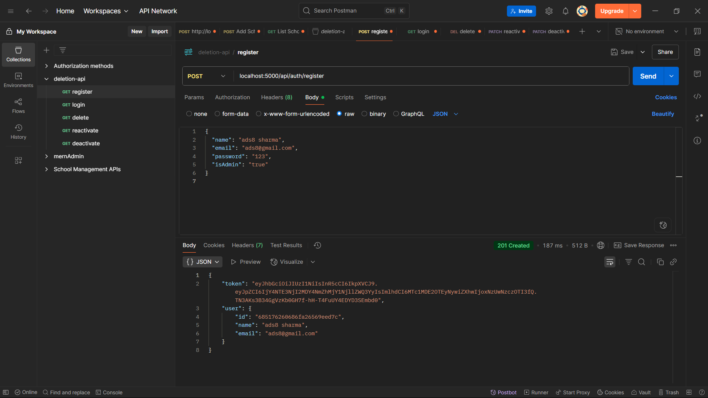
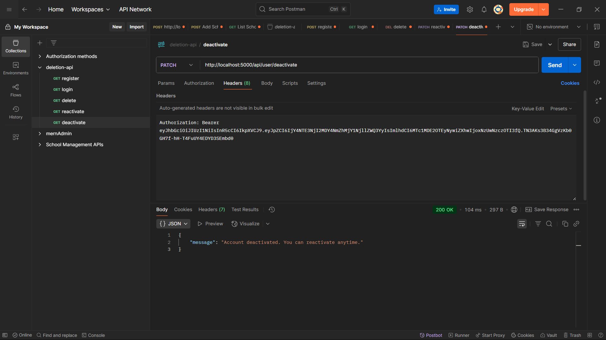
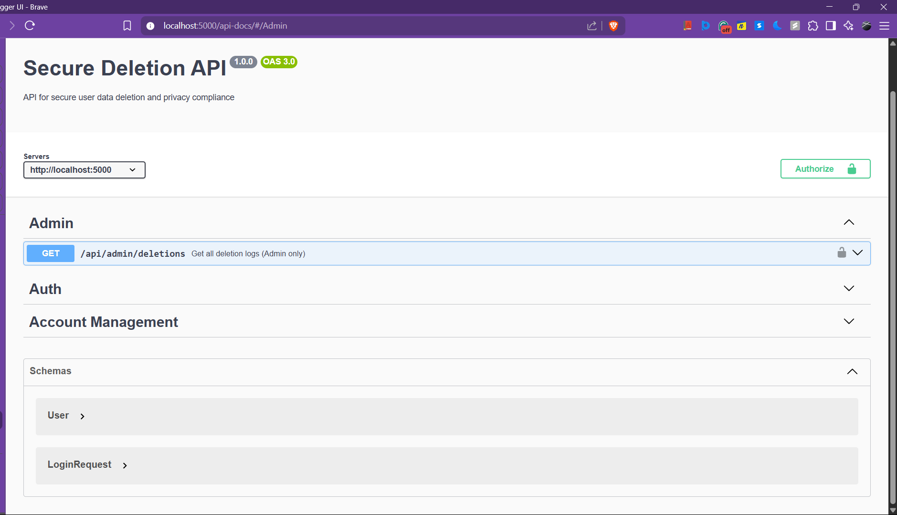
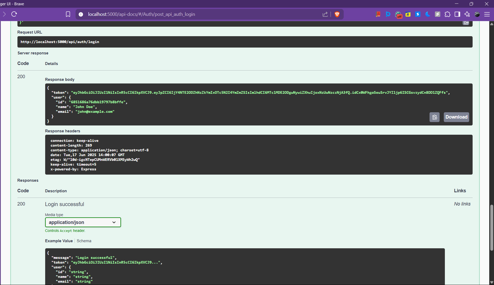
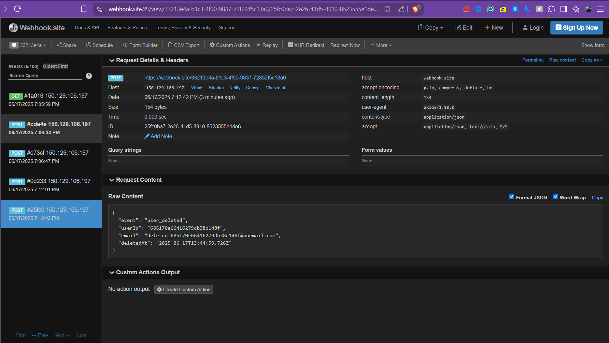

# 🧹 Secure Deletion API

A RESTful backend that lets users securely delete their data, aligned with GDPR. Built with Node.js, Express, and MongoDB.

---

## 🚀 Features

- **User Registration/Login** with JWT authentication  
- **Secure Delete** with complete data anonymization  
- **Soft Deletion** (deactivate/reactivate accounts)  
- **Email Confirmation** using Nodemailer  
- **Rate Limiting** on sensitive routes for security  
- **Admin-only access** to Deletion Logs  
- **Webhook Notifications** on successful deletions  
- **Full Swagger API Documentation**

---

## 📂 Project Structure

```
secure-deletion-api/
├── config/              # Swagger config and env setup
├── controllers/         # Business logic controllers
├── models/              # MongoDB/Mongoose schemas
├── routes/              # API route definitions
├── middlewares/         # Custom middleware functions
├── utils/               # Utility functions
├── tests/               # Jest test suites
├── public/              # Static assets & screenshots
│   ├── postman.png
│   ├── postman1.png
│   ├── swagger.png
│   ├── swagger1.png
│   └── webhook.png
├── .env.example         # Environment variables template
├── server.js            # Application entry point
└── package.json         # Dependencies & scripts
```

---

## 🔧 Tech Stack

- **Backend**: Node.js + Express.js  
- **Database**: MongoDB + Mongoose ODM  
- **Authentication**: JWT (JSON Web Tokens)  
- **Email Service**: Nodemailer  
- **Documentation**: Swagger/OpenAPI  
- **Testing**: Jest + Supertest  
- **Security**: Rate limiting, input validation

---

## ⚙️ Setup & Installation

### 1. Clone the Repository

```bash
git clone https://github.com/<your-username>/secure-deletion-api.git
cd secure-deletion-api
```

### 2. Install Dependencies

```bash
npm install
```

### 3. Environment Configuration

Create a `.env` file from the provided template:

```bash
cp .env.example .env
```

Update `.env` with your own values:

```env
PORT=5000
MONGO_URI=your_mongodb_connection_string
JWT_SECRET=your_super_secret_jwt_key
EMAIL_USER=your_email@gmail.com
EMAIL_PASS=your_app_specific_password
WEBHOOK_URL=https://webhook.site/your-unique-id
```

### 4. Start Development Server

```bash
npm run dev
```

### 5. Run Tests

```bash
npm test
```

---

## 🧪 API Documentation

Interactive API docs available at:  
**`http://localhost:5000/api-docs`**

### Key Endpoints

| Method | Endpoint                  | Description                      |
|--------|---------------------------|----------------------------------|
| POST   | `/api/auth/register`      | User registration                |
| POST   | `/api/auth/login`         | User login                       |
| DELETE | `/api/user/secure-delete` | Secure data deletion             |
| PATCH  | `/api/user/soft-delete`   | Soft delete (deactivate account) |
| PATCH  | `/api/user/reactivate`    | Reactivate account               |
| GET    | `/api/admin/deletions`    | View deletion logs (Admin only)  |

---

## 👤 Admin Access

To access admin-only routes like deletion logs:

### 1. Set Admin Privileges in DB

```js
db.users.updateOne(
  { email: "your-email@example.com" },
  { $set: { isAdmin: true } }
)
```

### 2. Use JWT for Authorization

```bash
GET /api/admin/deletions
Authorization: Bearer <your-jwt-token>
```

---

## 📱 Screenshots & Demos

### API Testing with Postman  
  


### Swagger UI Documentation  
  


### Webhook Notifications  


---

## 🔒 Security Features

- JWT Authentication  
- Rate Limiting on Sensitive Routes  
- Input Validation Middleware  
- GDPR-Compliant Secure Deletion  
- Password Hashing using Bcrypt  
- Environment Variables for Config Security  

---

## 🧪 Testing

```bash
# Run all tests
npm test

# Run tests with coverage
npm run test:coverage

# Run tests in watch mode
npm run test:watch
```


## 📋 API Usage Examples

### ✅ User Registration

```http
POST /api/auth/register
Content-Type: application/json

{
  "name": "John Doe",
  "email": "john@example.com",
  "password": "securePassword123"
}
```

### ❌ Secure Data Deletion

```http
DELETE /api/user/secure-delete
Authorization: Bearer <jwt-token>
Content-Type: application/json

{
  "confirmationCode": "DELETE_MY_DATA",
  "reason": "No longer need the service"
}
```

---

## 🤝 Contributing

1. Fork the repository  
2. Create a feature branch  
```bash
git checkout -b feature/amazing-feature
```
3. Commit your changes  
```bash
git commit -m 'Add amazing feature'
```
4. Push to GitHub  
```bash
git push origin feature/amazing-feature
```
5. Open a Pull Request 🚀

---

## 📝 License

This project is licensed under the **MIT License**.  
See the [LICENSE](LICENSE) file for details.

---

## 👩‍💻 Author

**Aditi Sharma**  
- GitHub: [@your-username](https://github.com/your-username)  
- Email: your-email@example.com

---

## 🔗 Useful Links

- [Live Swagger Docs](http://localhost:5000/api-docs)  
- [MongoDB Docs](https://docs.mongodb.com/)  
- [Express.js](https://expressjs.com/)  
- [JWT Guide](https://jwt.io/)

---

> *Built with ❤️ for GDPR compliance and user privacy*
